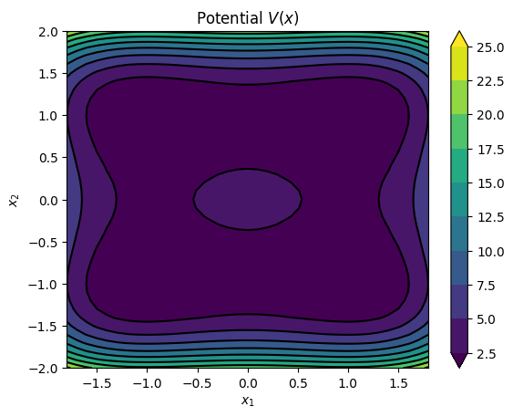
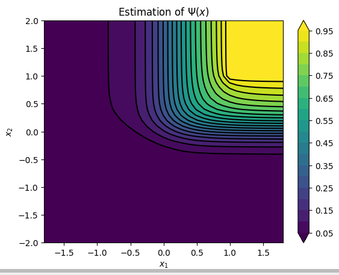

# sde-hjb-solver

This Python repository contains the implementation of the finite difference method for solving the Hamilton-Jacobi-Bellman (HJB) equation associated to the importance sampling (IS) problem of diffusion processes.

## Setting

### Importance sampling problem
Consider the stochastic process in $\mathbb{R}^d$ following the controlled dynamics for a given potential landscape $V$:
$$\mathrm{d} X_s^u = (-\nabla V(X_s^u) + \sigma(X_s^u)  \,  u(X_s^u))\mathrm{d}s + \sigma(X_s^u) \mathrm{d}W_s, \qquad X_0^u = x.$$

We aim to estimate the following expectation value by doing importance sampling
$$\Psi(x) = \mathbb{E}^x \bigl[I(X) \bigr] = \mathbb{E}^x \bigl[I(X^u) M^u \bigr], \quad I(X) = \exp \Bigl( -g(x_\tau) - \int\limits_0^\tau f(X_t) \mathrm{d}t \Bigl),$$
where $\tau_C$ is the first hitting time of the target set $C \subset \mathbb{R}^d$ and $M^u$ is the corresponding exponential Martingale provided by the Girsanov formula.

Every control $u^* \in \mathcal{U}$ provides us with an unbiased estimator of $\Psi(x)$. We want to find the $u^* \in \mathcal{U}$ which minimizes the variance of the importance sampling estimator 
$$u^* \in \text{argmin}_u \{ \text{Var}^x \bigl(I(X^u) M^u \bigr) \}.$$

### HJB equation
It is well known that the quantity that we want to estimate satisfies the following BVP
$$(\mathcal{L} -f(x)) \Psi(x) = 0 \quad \forall x \in \mathcal{O}, \quad \Psi(x) = \exp(-g(x)) \quad \forall x \in \partial{\mathcal{O}},$$
on the domain $\mathcal{O} \coloneqq \mathcal{D} \cap C^c$ where $\mathcal{L}$ denotes the infinitesimal generator of the original not controlled process i.e. case $u=0$.

## Contains

- Finite difference method for the 1d and 2d cases where the original stochastic dynamics follow the overdamped langevin equation with double well potential. 

## Install

1) clone the repo 
```
git clone git@github.com:riberaborrell/sde-hjb-solver.git
```

2) move inside the directory, create virtual environment and install required packages
```
cd sde-hjb-solver
make venv
```

3) activate venv
```
source venv/bin/activate
```

4) create config.py file and edit it
```
cp src/sde_hjb_solver/config_template.py src/sde_hjb_solver/config.py
```


## Developement

in step 2) also install developement packages
```
make develop
```

## Examples
#### 1d double well and mgf setting
Overdamped langevin dynamics with the 1-dimensional double well potential and the momgent generating function (MGF) setting ($f=\lambda=1$, $g=0$, $\tau=\tau_C$) and target set $C = [1, \infty)$.

```
$ python src/sde_hjb_solver/compute_hjb_solution_1d_st.py --setting mgf --alpha-i 1 --beta 1 --h 0.001 --plot
```
<table>
  <tr>
    <td></td>
    <td></td>
  </tr>
  <tr>
    <td></td>
    <td></td>
  </tr>
 </table>

#### 2d asymmetric double well and mgf setting
Overdamped langevin dynamics with the asymmetric 2-dimensional double well potential ($\alpha=(1, 2)$), MGF setting and target set $C = [1, \infty)^2$.
```
$ python src/sde_hjb_solver/compute_hjb_solution_2d_st.py --setting mgf --beta 1 --h 0.05 --plot
```
<table>
  <tr>
    <td></td>
    <td></td>
  </tr>
  <tr>
    <td></td>
    <td></td>
  </tr>
 </table>

 #### 2d triple well and committor setting
Overdamped langevin dynamics with the 2-dimensional triple well potential and the committor setting: ($f=0$, $g=-log 1_B$, $\tau = \tau_A \wedge \tau_B $).
<table>
  <tr>
    <td></td>
    <td></td>
    <td></td>
  </tr>
 </table>

